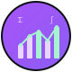

<!--
  pr1m8 / pr1m8 — Profile README
  Theme: Hacker Purple (#A855F7) + Dark Background (#0D1117)
  Consistent purple/violet theming across all elements
-->

## 👾 Hey, I'm Will

**Agent Architect | Quantitative Modeler | AI Systems Engineer**

<!-- Animated skills showcase -->

  <picture>
    <!-- Dark mode -->
    <source media="(prefers-color-scheme: dark)" srcset="https://readme-typing-svg.herokuapp.com/?lines=AI+Agent+Architect;Autonomous+Systems+Engineer;Graph+AI+%7C+RAG+%7C+Quant&font=Fira+Code&color=%23A855F7&center=true&width=720&height=45&size=18">
    <!-- Light mode -->
    
  </picture>

I design intelligent systems that bridge AI, automation, and structured reasoning. My work focuses on **scalable, interpretable, and modular AI architectures** that can dynamically retrieve, process, and act on information.

---

## 📊 GitHub Activity

<!-- Contribution Activity -->

  

<!-- Main Stats and Streak -->
<table>
<tr>
<td align="center">
  
</td>
<td align="center">
  
</td>
</tr>
</table>

<!-- Languages and Metrics -->
<table>
<tr>
<td align="center">
  
</td>
<td align="center">
  <!-- Auto-updated detailed metrics from .github/workflows/metrics.yml -->
  <!-- Includes: lines of code, contributions, habits, achievements -->
  
</td>
</tr>
</table>

---

## 🛠 Tech Stack

<b>🤖 AI & Machine Learning</b>

 

<b>⚡ Backend & API Development</b>

 

<b>🎨 Frontend & User Interfaces</b>

 

<b>🗄️ Data & Infrastructure</b>

 

<b>🔧 DevOps & Development Tools</b>

 

---

## 🎯 Core Expertise

<table>
<tr>
<td align="center" width="25%">
  
  <h3>🤖 AI Agents</h3>
  
Multi-agent architectures with dynamic workflows

</td>
<td align="center" width="25%">
  
  <h3>📊 Quantitative</h3>
  
ML-driven financial modeling and strategies

</td>
<td align="center" width="25%">
  
  <h3>🔗 Graph AI</h3>
  
Knowledge graphs and RAG optimization

</td>
<td align="center" width="25%">
  
  <h3>⚡ Autonomous</h3>
  
Real-time decision systems

</td>
</tr>
</table>

---

## 🚀 Featured Projects

| Project | Description | Tech Stack | Status |
|---------|-------------|------------|--------|
| [⚡ **Haive**](https://github.com/0rac130fD31phi/haive) | Modular AI agent framework for scalable intelligence | LangChain, Python, FastAPI | 🟢 Active |
| 🔬 **FLSTAESR** | Automated RAG pipeline for structured retrieval & reasoning | Graph AI, Vector DBs, ML | 🟡 Development |
| 📊 **Quant AI** | Algorithmic models for data-driven decision-making | Python, Statistics, Finance | 🟢 Active |

---

## 🌐 Connect With Me

  
  
  
  

  <em>"Tools shape thought. Build tools worth thinking with."</em>

<!-- 
Configuration Notes:
- Metrics auto-update every 12 hours via .github/workflows/metrics.yml
- Includes lines of code tracking via plugin_lines
- Purple theme (#A855F7) consistent across all elements
- Images organized in ./images/ folder structure
-->